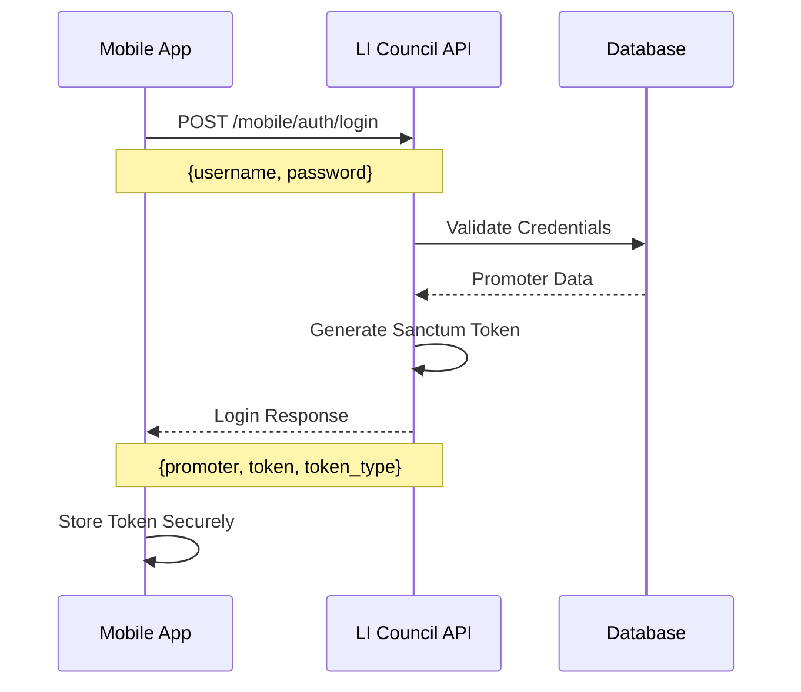
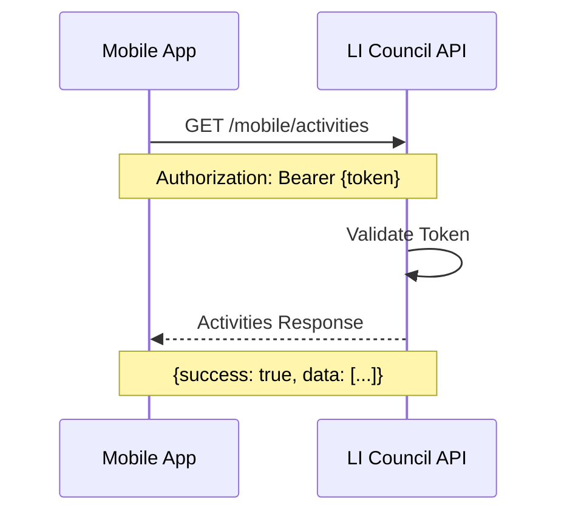

# Mobile App Integration Guide

This guide helps mobile developers integrate with the LI Council API efficiently.

## Architecture Overview

### API Structure
```
LI Council API
├── Mobile Endpoints (/mobile/*)
│   ├── Authentication (/mobile/auth/*)
│   ├── Activities (/mobile/activities)
│   └── Route Plans (/mobile/route-plans)
└── Admin Endpoints (/*) 
    ├── Authentication (/auth/*)
    ├── Promoter Management (/promoters)
    ├── Activity Management (/activity-recces)
    └── Route Plan Management (/route-plans)
```

## Authentication Flow

### 1. Login Process


### 2. Authenticated Requests


## Data Models

### Core Models for Mobile App

#### Promoter
```typescript
interface Promoter {
  id: number;
  name: string;
  username: string;
  email: string;
  phone: string;
  state: string;
  district: string;
  sub_district: string;
  village: string;
  is_active: boolean;
  is_logged_in: boolean;
  profile_image?: string;
  last_login_at?: string;
  created_at: string;
  updated_at: string;
}
```

#### Activity
```typescript
interface Activity {
  id: number;
  visit_date: string; // YYYY-MM-DD
  promoter_id: number;
  plan_id?: number;
  device_id?: string;
  activity_type: 'recce' | 'visit' | 'survey';
  product_type: 'Grey' | 'Gold' | 'Pink' | 'Brown';
  state: string;
  district: string;
  sub_district: string;
  village: string;
  village_code: string;
  location: string;
  landmark?: string;
  latitude?: number;
  longitude?: number;
  remarks?: string;
  close_shot1?: string;
  close_shot_2?: string;
  long_shot_1?: string;
  long_shot_2?: string;
  status: 'pending' | 'completed' | 'cancelled';
  created_at: string;
  updated_at: string;
  promoter?: Promoter;
  route_plan?: RoutePlan;
}
```

#### Route Plan
```typescript
interface RoutePlan {
  id: number;
  plan_name: string;
  state: string;
  district: string;
  sub_district: string;
  village: string;
  village_code: string;
  location: string;
  landmark?: string;
  latitude?: number;
  longitude?: number;
  status: 'active' | 'inactive' | 'completed';
  promoter_id?: number;
  created_at: string;
  updated_at: string;
}
```

## Implementation Patterns

### 1. Authentication Service

#### React Native Example
```typescript
class AuthService {
  private baseURL = 'https://li-council.test/api';
  private token: string | null = null;

  async login(username: string, password: string): Promise<LoginResponse> {
    const response = await fetch(`${this.baseURL}/mobile/auth/login`, {
      method: 'POST',
      headers: {
        'Content-Type': 'application/json',
      },
      body: JSON.stringify({ username, password }),
    });

    const data = await response.json();
    
    if (data.success) {
      this.token = data.data.token;
      await AsyncStorage.setItem('auth_token', this.token);
      await AsyncStorage.setItem('promoter_data', JSON.stringify(data.data.promoter));
    }
    
    return data;
  }

  async getProfile(): Promise<Promoter> {
    const response = await this.authenticatedRequest('/mobile/auth/profile');
    return response.data;
  }

  private async authenticatedRequest(endpoint: string, options: RequestInit = {}) {
    const token = this.token || await AsyncStorage.getItem('auth_token');
    
    return fetch(`${this.baseURL}${endpoint}`, {
      ...options,
      headers: {
        'Authorization': `Bearer ${token}`,
        'Content-Type': 'application/json',
        ...options.headers,
      },
    }).then(res => res.json());
  }
}
```

#### Flutter Example
```dart
class AuthService {
  static const String baseURL = 'https://li-council.test/api';
  String? _token;

  Future<LoginResponse> login(String username, String password) async {
    final response = await http.post(
      Uri.parse('$baseURL/mobile/auth/login'),
      headers: {'Content-Type': 'application/json'},
      body: jsonEncode({
        'username': username,
        'password': password,
      }),
    );

    final data = jsonDecode(response.body);
    
    if (data['success']) {
      _token = data['data']['token'];
      await _storeToken(_token!);
      await _storePromoterData(data['data']['promoter']);
    }
    
    return LoginResponse.fromJson(data);
  }

  Future<http.Response> authenticatedRequest(String endpoint, {
    String method = 'GET',
    Map<String, dynamic>? body,
  }) async {
    final token = _token ?? await _getStoredToken();
    
    return http.Request(method, Uri.parse('$baseURL$endpoint'))
      ..headers.addAll({
        'Authorization': 'Bearer $token',
        'Content-Type': 'application/json',
      })
      ..body = body != null ? jsonEncode(body) : null;
  }
}
```

### 2. Activity Management

#### Creating Activities with Images
```typescript
class ActivityService {
  async createActivity(activityData: CreateActivityRequest): Promise<Activity> {
    // Convert images to base64 if needed
    const processedData = {
      ...activityData,
      close_shot1: await this.imageToBase64(activityData.close_shot1),
      close_shot_2: await this.imageToBase64(activityData.close_shot_2),
      long_shot_1: await this.imageToBase64(activityData.long_shot_1),
      long_shot_2: await this.imageToBase64(activityData.long_shot_2),
    };

    const response = await this.authenticatedRequest('/mobile/activities', {
      method: 'POST',
      body: JSON.stringify(processedData),
    });

    return response.data;
  }

  private async imageToBase64(imageUri: string): Promise<string | undefined> {
    if (!imageUri) return undefined;
    
    // React Native implementation
    const response = await fetch(imageUri);
    const blob = await response.blob();
    return new Promise((resolve) => {
      const reader = new FileReader();
      reader.onload = () => resolve(reader.result as string);
      reader.readAsDataURL(blob);
    });
  }
}
```

### 3. Offline Data Sync

#### Sync Strategy
```typescript
class SyncService {
  private pendingActivities: Activity[] = [];

  async syncPendingActivities(): Promise<void> {
    const pending = await this.getPendingActivities();
    
    for (const activity of pending) {
      try {
        await this.activityService.createActivity(activity);
        await this.removePendingActivity(activity.id);
      } catch (error) {
        console.error('Failed to sync activity:', error);
        // Keep in pending list for retry
      }
    }
  }

  async createActivityOffline(activity: CreateActivityRequest): Promise<void> {
    // Store locally with pending status
    const localActivity = {
      ...activity,
      id: Date.now(), // Temporary ID
      status: 'pending',
      created_at: new Date().toISOString(),
    };
    
    await this.storePendingActivity(localActivity);
  }
}
```

## Error Handling

### Standard Error Response
```typescript
interface ErrorResponse {
  success: false;
  message: string;
  errors?: Record<string, string[]>; // Validation errors
}
```

### Error Handling Pattern
```typescript
class APIClient {
  async handleResponse<T>(response: Response): Promise<T> {
    const data = await response.json();
    
    if (!response.ok) {
      switch (response.status) {
        case 401:
          // Token expired, redirect to login
          await this.authService.logout();
          throw new Error('Authentication required');
        
        case 422:
          // Validation errors
          throw new ValidationError(data.errors);
        
        case 403:
          throw new Error('Insufficient permissions');
        
        case 404:
          throw new Error('Resource not found');
        
        default:
          throw new Error(data.message || 'An error occurred');
      }
    }
    
    return data;
  }
}
```

## Performance Optimization

### 1. Pagination Implementation
```typescript
class DataLoader<T> {
  private currentPage = 1;
  private hasMoreData = true;
  private loading = false;

  async loadMore(): Promise<T[]> {
    if (this.loading || !this.hasMoreData) return [];
    
    this.loading = true;
    
    try {
      const response = await this.apiClient.get(`/mobile/activities?page=${this.currentPage}`);
      
      this.currentPage++;
      this.hasMoreData = response.current_page < response.last_page;
      
      return response.data;
    } finally {
      this.loading = false;
    }
  }
}
```

### 2. Caching Strategy
```typescript
class CacheService {
  private cache = new Map<string, { data: any; timestamp: number }>();
  private cacheTimeout = 5 * 60 * 1000; // 5 minutes

  async get<T>(key: string, fetcher: () => Promise<T>): Promise<T> {
    const cached = this.cache.get(key);
    
    if (cached && Date.now() - cached.timestamp < this.cacheTimeout) {
      return cached.data;
    }
    
    const data = await fetcher();
    this.cache.set(key, { data, timestamp: Date.now() });
    
    return data;
  }
}
```

## Testing

### API Testing with Jest
```typescript
describe('AuthService', () => {
  it('should login successfully with valid credentials', async () => {
    const mockResponse = {
      success: true,
      data: {
        promoter: { id: 1, name: 'Test Promoter' },
        token: 'test-token',
        token_type: 'Bearer'
      }
    };

    global.fetch = jest.fn().mockResolvedValue({
      json: () => Promise.resolve(mockResponse)
    });

    const authService = new AuthService();
    const result = await authService.login('test', 'password');

    expect(result.success).toBe(true);
    expect(result.data.token).toBe('test-token');
  });
});
```

## Security Best Practices

### 1. Token Storage
```typescript
// Use secure storage for tokens
import { getGenericPassword, setGenericPassword } from 'react-native-keychain';

class SecureStorage {
  async storeToken(token: string): Promise<void> {
    await setGenericPassword('auth_token', token);
  }

  async getToken(): Promise<string | null> {
    const credentials = await getGenericPassword();
    return credentials ? credentials.password : null;
  }
}
```

### 2. API Request Validation
```typescript
class RequestValidator {
  validateActivityData(data: CreateActivityRequest): void {
    if (!data.visit_date) throw new Error('Visit date is required');
    if (!data.location) throw new Error('Location is required');
    if (!['recce', 'visit', 'survey'].includes(data.activity_type)) {
      throw new Error('Invalid activity type');
    }
  }
}
```

## Deployment Considerations

### Environment Configuration
```typescript
const config = {
  development: {
    baseURL: 'http://localhost:8000/api',
    timeout: 10000,
  },
  production: {
    baseURL: 'https://li-council.test/api',
    timeout: 15000,
  },
};

export default config[process.env.NODE_ENV || 'development'];
```

---

*For complete API reference, see [API_DOCUMENTATION.md](../API_DOCUMENTATION.md)*
